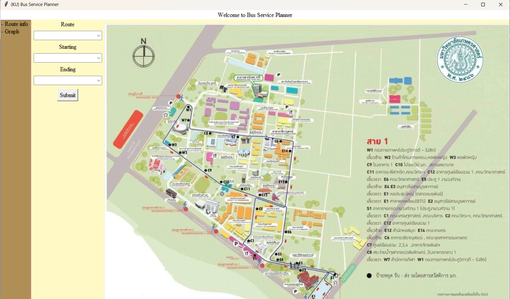

# Bus Service Planner
[](https://github.com/Phantawat/Bus-Service-Planner)

## Description
The Bus Service Planner is a graphical user interface application designed to assist users in planning bus routes. Users can input their desired starting and ending bus stops, and the application will provide route information. The project aims to develop a Shuttle Bus Service Route Planner for Kasetsart University, facilitating efficient navigation and finding a shortest route for students and staff.

## Screenshots


## Installation
To install the Bus Service Planner, follow these steps:

1. Clone the repository to your local machine.
2. Install the required dependencies using pip:
    ```
    pip freeze > requirements.txt
    pip install -r requirements.txt
    ```
3. Prepare the necessary data by downloading the bus data from [Bus_Service_Planner.csv].

## How to Run
To run the Bus Service Planner, follow these steps:

1. Navigate to the project directory in your terminal.
2. Run the main Python script:
    ```
    python bus_service_app.py
    ```
3. The Bus Service Planner GUI will launch.


## Data Sources
- [Data Sources](https://www.ku.ac.th/en/car-service-routes-in-maha-vickya-sai)
- [Data set](https://docs.google.com/spreadsheets/d/1eil-F8yGgeJ3ZWY_8qBBGd5DH3EDElP8w0XH5MNN1zw/edit?usp=sharing)
